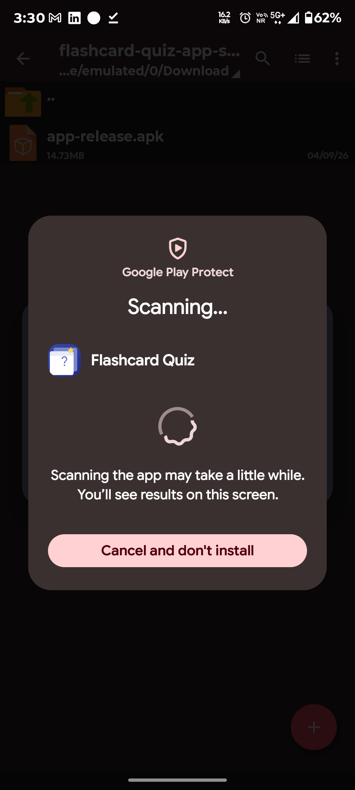
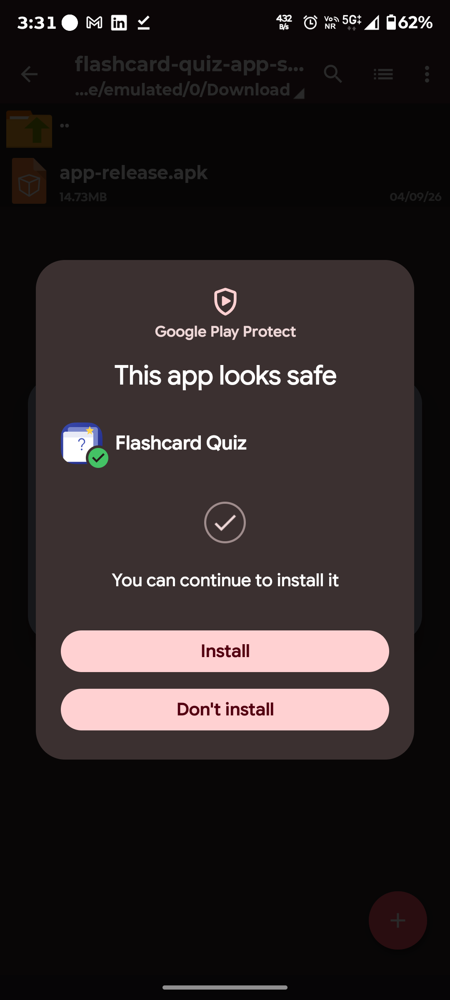

# 📚 Flashcard Quiz App

A simple, clean, and interactive Android Flashcard Quiz App developed as **Task 1 of the CodeAlpha App Development Internship**.

The app helps users study using digital flashcards: view a question, reveal the answer, and move between cards using Previous and Next navigation. Users can also manage their own flashcards by adding, editing, and deleting cards.

## ✨ Features

- 🃏 **Flashcard-based learning** — Display a question on the front of a card and reveal its answer.
- 👁️ **Show Answer** — Reveal the answer with a dedicated action.
- ⬅️ **Previous / Next navigation** — Move easily through the flashcard collection.
- ➕ **Add flashcards** — Create new question-and-answer cards.
- ✏️ **Edit flashcards** — Update existing flashcards.
- 🗑️ **Delete flashcards** — Remove flashcards that are no longer needed.
- 📱 **Android application** — Packaged as an installable APK.
- 🎨 **Clean and simple UI** — Designed for straightforward studying and navigation.

## 🛠️ Technology Stack

- **Platform:** Android
- **Language:** Kotlin
- **Build System:** Gradle / Kotlin DSL
- **Project Structure:** Standard Android application project
- **Source:** Kotlin + Android resources
- **CI/CD:** GitHub Actions

## 📂 Project Structure

```text
CodeAlpha_FlashCardQuizApp/
├── app/
│   ├── src/
│   │   ├── main/
│   │   │   ├── java/
│   │   │   ├── res/
│   │   │   └── AndroidManifest.xml
│   │   ├── test/
│   │   └── androidTest/
│   ├── build.gradle.kts
│   └── proguard-rules.pro
├── .github/
│   └── workflows/
│       └── android.yml
├── screenshots/
├── build.gradle.kts
├── gradle.properties
├── settings.gradle.kts
└── metadata.json
```

## 🚀 How to Build

### Option 1 — Android Studio

1. Clone or download this repository.
2. Open the project in Android Studio.
3. Allow Gradle to sync and download required dependencies.
4. Select the `app` configuration.
5. Build the project or run it on an Android device/emulator.

### Option 2 — Gradle

For local development/testing:

```bash
./gradlew assembleDebug
```

On Windows:

```powershell
.\gradlew.bat assembleDebug
```

The generated debug APK will normally be available at:

```text
app/build/outputs/apk/debug/app-debug.apk
```

For a Release build:

```bash
./gradlew assembleRelease
```

The generated Release APK will normally be available at:

```text
app/build/outputs/apk/release/app-release.apk
```

## 📦 APK & GitHub Actions

The repository's GitHub Actions workflow builds a **signed Release APK** for installation testing and submission.

The workflow:

1. Checks out the source code.
2. Configures the required Java/Gradle environment.
3. Generates a CI release signing key.
4. Builds the application with `assembleRelease`.
5. Verifies the APK signature.
6. Uploads the signed Release APK as a workflow artifact.

To obtain the latest CI-built Release APK:

1. Open the repository on GitHub.
2. Go to **Actions**.
3. Open the latest successful Android workflow run.
4. Download the Release APK artifact.
5. Extract the artifact to access `app-release.apk`.

> **Signing note:** The current CI workflow generates an ephemeral signing key for each CI build. For a production application with future updates, a stable developer signing key should be securely retained and reused.

## 🛡️ Google Play Protect & Security Verification

This project is maintained transparently in a public GitHub repository, with its Android source code, build configuration, and CI workflow available for inspection.

The submitted APK is generated from the repository source through GitHub Actions as a **signed Release APK**, and the workflow verifies the APK signature before publishing the build artifact.

### Play Protect status

A physical-device installation test was performed with Google Play Protect enabled. The tested APK completed the available Play Protect installation check and was allowed to install without the previous harmful-app warning.

The screenshots below document the Play Protect verification flow observed on the test device.

### Google Play Protect verification evidence

**Play Protect scan:**



**Play Protect result:**



This should be understood as an **observed test result for the tested APK and device**, not as a universal Play Protect approval or certification.

**Important device-compatibility note:** Google Play Protect is a dynamic security system. The exact scan screen, warning, or safe-to-install message may not appear on every device or installation. Results and displayed messages can vary depending on the device, Android version, Google Play services, account/device state, APK version, installation history, and Google's current security systems. Therefore, this project does not claim that every device will display the same verification screen or produce the same result for every future build.

### Security/maintenance indicators

| Check | Status |
|---|---|
| Public source repository | ✅ |
| Source available for inspection | ✅ |
| Signed Release APK | ✅ |
| APK signature verified in CI | ✅ |
| Android permissions | ✅ No unnecessary permissions declared |
| Physical-device Play Protect test | ✅ Completed |
| Play Protect verification screenshots | ✅ Included above |
| Universal Play Protect approval/certification | ❌ Not claimed |

Keep Google Play Protect enabled when installing APKs from outside Google Play.

## 🔄 Continuous Integration

GitHub Actions is configured to automatically build the Android project and provide a signed Release APK artifact from successful workflow runs.

## 🎯 CodeAlpha Internship

**Program:** CodeAlpha App Development Internship  
**Task:** Task 1 — Flashcard Quiz App

This project was created to satisfy the Flashcard Quiz App requirements provided for the CodeAlpha App Development Internship.

### Task Requirements Covered

| Requirement | Implementation |
|---|---|
| Flashcard question and answer | ✅ |
| Show Answer button/action | ✅ |
| Next button | ✅ |
| Previous button | ✅ |
| Add flashcards | ✅ |
| Edit flashcards | ✅ |
| Delete flashcards | ✅ |
| Simple, clean UI | ✅ |
| Complete source code on GitHub | ✅ |
| Android APK | ✅ |

## 📸 Screenshots

The repository contains application UI screenshots demonstrating the flashcard interface and its main functionality. Google Play Protect verification evidence is included in the security section above.

## 📥 Clone the Repository

```bash
git clone https://github.com/saba1207B/CodeAlpha_FlashCardQuizApp.git
cd CodeAlpha_FlashCardQuizApp
```

## 👨‍💻 Developer

**Sabareesh**  
GitHub: [@saba1207B](https://github.com/saba1207B)

## 📄 License

This project was developed for educational and internship purposes as part of the CodeAlpha App Development Internship.
